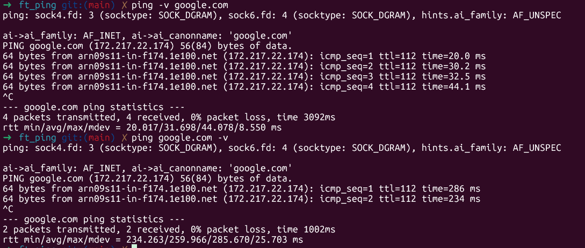

# FT_PING

Qu'est ce que c'est ping?

Ping envoie un message d echo ICMP a un hote a distance. Quand l'hote recoit ce message, il copie le domaine de la requete dans un message de reponse a echo et la renvoie.  
Ping sert notamment a mesurer la latence reseau, la qualite de connexion, la stabilite et les pertes.

En gros le projet se resume a envoyer un paquet (sendto), attendre la reponse (recvfrom), calculer le RTT[^1], afficher le resultat, mise a jour des stats, sleep(1), refaire en boucle jusqu a un ctrl C.

## ICMP (Internet Control Message Protocol)

Pour se renseigner sur le ICMP, il va falloir se tourner vers le [RFC 792](http://patrick.monassier.free.fr/rfc/rfc792.htm).  
On va plus particulierement s'interesser a la partie "Message d'écho et de réponse à écho" puisqu on ne va faire que ce qui est demande dans le sujet.  
Et heureusement parce que seul les messages d echo et les reponses d echo peuvent etre recu et envoye directement.
Par default le kernel ne permet pas les echnages de datagrammes ICMP pour les utilisateurs (meme root).
Normalement les distributions recentes le permettent et c est pour ca que le sujet requiert une distrib plutot recente (meme si debian 7 date de 2013).  

## Explications des champs ICMP [RFC 792](http://patrick.monassier.free.fr/rfc/rfc792.htm)

Type: indique le type de message ICMP, 0 pour la reponse d echo (hote) ou 8 pour un message d echo (quand on envoit le ping).   
Code: c est presque toujours 0 donc on mettra toujours 0.  
Checksum: Permet de verifier que le paquet n a pas ete corrompu avec un calcul special en inversant les bits grace a l operateur '~'.  
Identificateur: sert a reconnaitre nos paquets (donc juste un getpid).  
Numero de sequence: compteur qui augmente.  
Data: le contenu du paquet. Le serveur renvoit les memes donnees.  

## Difference entre bit et bytes

Il faut aussi bien comprendre qu un **bit** est la plus petite unite d information alors qu un **byte** est un groupe de 8 **bit**.  
Un **bit** ne peut donc contenir qu un 0 ou un 1 donc seulement 2 valeurs alors qu un byte peut en contenir 256.  
**1 byte = 8 bits**

## Qu est ce qu un paquet reseau?

Quand on fait un ping un envoie un bloc organise comme ca:  
[ informations reseau ][ informations ICMP ][ donnees ]  
Les informations reseau sont le Header IP qui contient adresse source, adresse destination, TTL[^2], infos de routage.  
Les informations ICMP, c est le type de message ICMP (voir [champs ICMP](#explications-des-champs-icmp-rfc-792)).  
Les donnees (payload) sont les donnees transportees donc en gros du texte.  

Quand on envoit un ping on construit les informations ICMP et les donnees et le kernel ajoutera lui meme les informations reseau.  
En revanche quand on recoit un paquet, on recoit tout mais nous ce qui nous interesse c est les infos ICMP et les donnees donc on va juste chercher a obtenir la taille des infos reseau pour avancer dans le buffer.

## Difference entre SOCK_RAW et SOCK_DGRAM

Sur ce screen on voit que le vrai ping parle de SOCK_DGRAM. Le vrai ping utilise SOCK_RAW et SOCK_DGRAM.  
Pour recoder ping, SOCK_DGRAM n a aucun interet puisque le kernel fait presque tout, il gere lui meme le header icmp, il calcul le [checksum](#checksum), il gere l id du paquet et ne necessite pas sudo.  
Mais il se peut que SOCK_DGRAM soit interdit par le sysctl ou parce que le kernel est trop vieux.  
Donc le vrai ping essaye d abord SOCK_DGRAM sans root et s il ne peut pas il utilise SOCK_RAW.  
En revanche avec SOCK_RAW il faut tout faire nous meme.

## Precisions des man

### Sommaire des fonctions

- [SOCKET](#socket)
- [GETUID](#getuid)
- [RECVFROM](#recvfrom)
- [GETADDRINFO](#getaddrinfo)
- [INET_NTOP](#inet_ntop)
- [INET_NTOA](#inet_ntoa)
- [CHECKSUM](#checksum)
- [SENDTO](#sendto)
- [SETSOCKOPT](#setsockopt)
- [SIGNAL](#signal)
- [GAI_STRERROR](#gai_strerror)

### SOCKET

**int socket(int domain, int type, int protocol);**

On va utiliser des **SOCK_RAW** qui sont le seul type nous permettant d utiliser le protocol ICMP et ce qui nous interesse c est l IPv4 donc le domain AF_INET.

| ARG | VALEUR | DEFINITION |
| ------- | ------ | ---------------- |
| domain | AF_INET | Utilise le protocol IPv4 |
| type | SOCK_RAW | On construit nous meme le header ICMP et le payload[^3] |
| protocol | IP_PROTOICMP | Nous restreint a l utilisation des paquets IP qui contiennent des messages ICMP |

[revenir au sommaire des fonctions](#sommaire-des-fonctions)

### GETUID

Pour manipuler des socket raw, il faut les droits d utilisateur root et l uid 0 c est root donc la fonction getuid nous permet juste de verifier si on est bien root.

[revenir au sommaire des fonctions](#sommaire-des-fonctions)

### RECVFROM

**ssize_t recvfrom(int sockfd, void buf[restrict .size], size_t size, int flags, struct sockaddr \*_Nullable restrict src_addr, socklen_t \*_Nullable restrict addrlen);**  

Cette fonction permet de recevoir un datagramme[^4] depuis une socket.  
Dans notre projet, elle sert a recuperer les reponses ICMP envoyees par l hote distant apres un `sendto()`.  
Les donnees recues sont placees dans un buffer fourni par l utilisateur.  
Avec une socket ICMP brute, le buffer contient :

| IP HEADER | ICMP HEADER | PAYLOAD |  

| Partie | Role |
| ------- | ------ |
| IP HEADER | Informations de transport (IP source, IP destination, TTL...) |
| ICMP HEADER | Type du message ICMP, identifiant, numero de sequence, checksum |
| PAYLOAD | Donnees transportees par le paquet |

Le ip header ne nous interesse donc on doit juste avancer dans le buffer.  
La taille du header IP est indique avec le champ **ihl** (Internet Header Lenght) qui contient le nombre de mots de 32bits (4 bytes).  
L ip header a une taille de 20bytes alors que l ICMP header a une taille de 8bytes.

Par defaut, recvfrom() attend indefiniment qu un paquet arrive mais on change ca avec des flags dans [setsockopt](#setsockopt) afin d eviter qu un hote qui ne repond pas bloque le programme.

[revenir au sommaire des fonctions](#sommaire-des-fonctions)

### GETADDRINFO

**int getaddrinfo(const char *node, const char *service, const struct addrinfo *hints, struct addrinfo res);**  

Cette fonction sert a convertir un nom d hote en adresse IP exploitable et donc dans le meme temps, verifier si l hote existe.  
Le resultat est stocke dans une structure addrinfo contenant notamment une structure sockaddr utilisable directement avec sendto().  

[revenir au sommaire des fonctions](#sommaire-des-fonctions)

### INET_NTOP

**const char *inet_ntop(int af, const void src, char dst, socklen_t size);**  

Cette fonction convertit une adresse IP binaire vers une chaine de caracteres lisible.  
On l utilise principalement pour afficher proprement les adresses IP.  

[revenir au sommaire des fonctions](#sommaire-des-fonctions)

### INET_NTOA

**char inet_ntoa(struct in_addr in);**  

Ancienne version simplifiee de inet_ntop().  
Elle ne fonctionne qu'avec IPv4.  

[revenir au sommaire des fonctions](#sommaire-des-fonctions)

### CHECKSUM

L ICMP impose qu une somme de controle soit presente dans chaque paquet.  
Cette valeur permet de detecter les erreurs de transmission.  
Le principe est simple :
- Additionner tous les mots de 16 bits du paquet.
- Replier les eventuels debordements.[^5]
- Inverser tous les bits avec l operateur ~.

Le destinataire effectue exactement le meme calcul.  
Si le resultat est different alors le paquet est corrompu.

[revenir au sommaire des fonctions](#sommaire-des-fonctions)

### SENDTO

**ssize_t sendto(int sockfd, const void buf, size_t len, int flags, const struct sockaddr dest_addr, socklen_t addrlen);**  
Cette fonction envoie les donnees contenues dans un buffer vers une destination.

[revenir au sommaire des fonctions](#sommaire-des-fonctions)

### SETSOCKOPT

**int setsockopt(int sockfd, int level, int optname, const void optval, socklen_t optlen);**

C est le menu de configarution des socket.  
Les flags IPPROTO_IP + IP_TTL permettent de changer le TTL (Time to Live).  
Le TTL représente le nombre maximal de routeurs qu'un paquet peut traverser.

Les flags SOL_SOCKET + SO_RCVTIMEO servent a ajouter un timeout sur les operations de lecture pour eviter que le [recvfrom](#recvfrom) attende indefiniment.

[revenir au sommaire des fonctions](#sommaire-des-fonctions)

### SIGNAL

C est le menu de configuration des signaux et permet de leur assigner des actions puisque [SIGINT](#sigint) et [SIGQUIT](#sigquit) ne font pas la meme chose.  
C est un peu la surcharge d operateur en C++.

[revenir au sommaire des fonctions](#sommaire-des-fonctions)

### GAI_STRERROR

**const char *gai_strerror(int errcode);**

Cette fonction permet de convertir un code d'erreur retourné par `getaddrinfo()` en message lisible.

[revenir au sommaire des fonctions](#sommaire-des-fonctions)

## Bizarreries

### Ping ne fonctionne pas avec plusieurs arguments

Neanmoins il faut bel et bien que chaque argument soit valide  

### SIGQUIT

SIGQUIT = ctrl + \  
SIGQUIT ne quitte pas mais donne un compte rendu  

### SIGINT

SIGINT = ctrl + C
Ca quitte mais avant ca donne un petit compte rendu  

### EOF

end of file = ctrl + D
Ca ne fait rien et on peut ecrire dans le terminal pendant que Ping est en cours donc on ne gere pas non plus les termios[^6]

### Flags

On peut mettre les flags avant ou apres l hote  

[^1]: RTT signifie Round Trip Time qui definit le temps total aller retour du paquet.  
[^2]: duree de vie du paquet  
[^3]: payload signifie "charge utile". C est la partie du paquet qui contient les donnees reellements transportees, par opposition aux informations techniques de transport (header).  
[^4]: Le terme datagramme est utilise dans tous les man et en gros designe un paquet mais autonome et sans garanti de livraison ou d ordre.  
[^5]: Le checksum ICMP travaille sur des mots de 16 bit mais en en additionnant plusieurs on peut vite depasser les 16 bits (65535) donc le bit de depassement revient au debut donc 65536 devient 1 un peu comme un overflow.  
[^6]: sert a redefinir les parametres du terminal (voir [tcsetattr](https://manpages.debian.org/testing/manpages-fr-dev/tcsetattr.3.fr.html))  