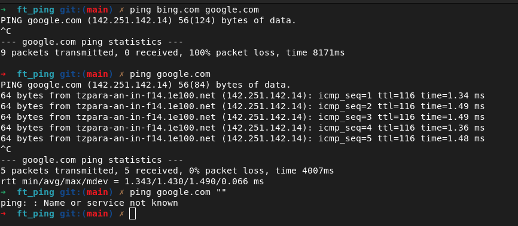
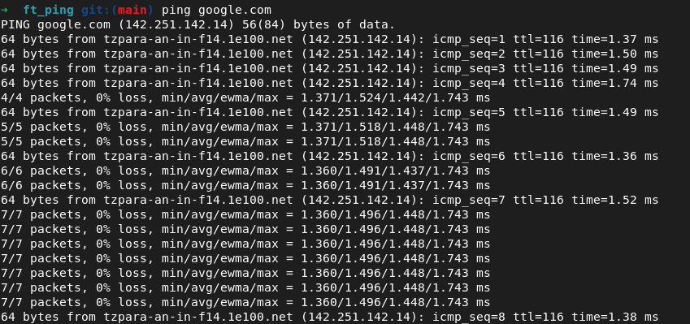
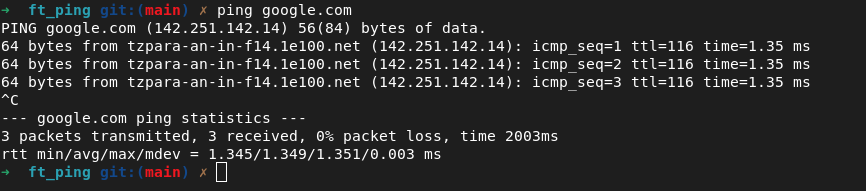

# FT_PING

Qu'est ce que c'est ping?

Ping envoie un message d echo ICMP a un hote a distance. Quand l'hote recoit ce message, il copie le domaine de la requete dans un message de reponse a echo et la renvoie.

## ICMP (Internet Control Message Protocol)

Pour se renseigner sur le ICMP, il va falloir se tourner vers le [RFC 792](http://patrick.monassier.free.fr/rfc/rfc792.htm).  
On va plus particulierement s'interesser a la partie "Message d'écho et de réponse à écho" puisqu on ne va faire que ce qui est demande dans le sujet.  
Et heureusement parce que seul les messages d echo et les reponses d echo peuvent etre recu et envoye directement.
Par default le kernel ne permet pas les echnages de datagrammes ICMP pour les utilisateurs (meme root).
Normalement les distributions recentes le permettent et c est pour ca que le sujet requiert une distrib plutot recente (meme si debian 7 date de 2013).  

## Explications des champs ICMP [RFC 792](http://patrick.monassier.free.fr/rfc/rfc792.htm)

Type: indique le type de message ICMP, 0 pour la reponse d echo (hote) ou 8 pour un message d echo (quand on envoit le ping).   
Code: c est presque toujours 0 donc on mettra toujours 0.  
Checksum: Permet de verifier que le paquet n a pas ete corrompu avec un calcul special en inversant les bits grace a l operateur '~'.  
Identificateur: sert a reconnaitre nos paquets (donc juste un getpid).  
Numero de sequence: compteur qui augmente.  
Data: le contenu du paquet. Le serveur renvoit les memes donnees.  

## Precisions des man

### SOCKET

- **int socket(int domain, int type, int protocol);**
- Normally only a single protocol exists to support a particular
       socket  **type** within a given protocol family, in which case protocol can
       be specified as 0.
- **SOCK_DGRAM**  and  **SOCK_RAW**  sockets allow sending of datagrams to corre‐
       spondents named in sendto(2) calls.  Datagrams are  generally  received
       with  recvfrom(2),  which  returns the next datagram along with the ad‐
       dress of its sender.

**SOCK_DGRAM** utilise le protocol UDP qui ne nous interesse pas pour ce projet.
On va donc utiliser **SOCK_RAW**.

| ARG | VALEUR | DEFINITION |
| ------- | ------ | ---------------- |
| domain | AF_INET | USE IPv4 Protocol |
| type | SOCK_RAW | On construit nous meme le header ICMP et le payload[^1] |
| protocol | IP_PROTOICMP | Nous restreint a l utilisation des paquets IP qui contiennent des messages ICMP |

### RECVFROM

**ssize_t recvfrom(int sockfd, void buf[restrict .size], size_t size, int flags, struct sockaddr \*_Nullable restrict src_addr, socklen_t \*_Nullable restrict addrlen);**  

Cette fonction sert a recevoir des messages de **sockfd** en les placant dans **buf** sachant que la taille du buffer doit etre precise dans **size**.  
Surement pas besoin de flags mais sinon voir **MSG_TRUNC**  

## Bizarreries

### Ping ne fonctionne pas avec plusieurs arguments

Neanmoins il faut bel et bien que chaque argument soit valide  

### SIGQUIT

SIGQUIT = ctrl + \  
SIGQUIT ne quitte pas mais donne un compte rendu  

### SIGINT

SIGINT = ctrl + C
Ca quitte mais avant ca donne un petit compte rendu  

### EOF

end of file = ctrl + D
Ca ne fait rien et on peut ecrire dans le terminal pendant que Ping est en cours donc on ne gere pas non plus les termios[^2]

[^1]: payload signifie "charge utile". C est la partie du paquet qui contient les donnees reellements transportees, par opposition aux informations techniques de transport (header).  
[^2]: sert a redefinir les parametres du terminal (voir [tcsetattr](https://manpages.debian.org/testing/manpages-fr-dev/tcsetattr.3.fr.html))